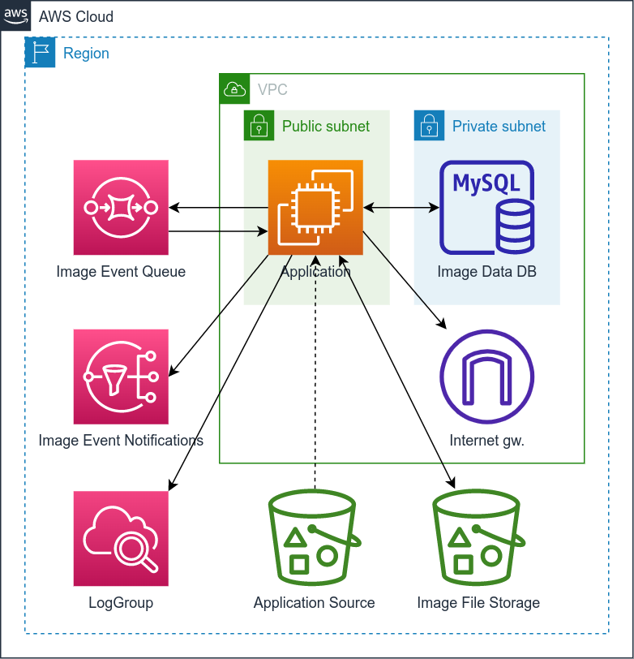

# IMAGE Stack

The stack contains the **IMAGE application**:

1. A new VPC is deployed with 1 public and 1 private subnet.
2. In the public subnet, an EC2 (t2.micro) instance is deployed.
3. On the EC2 instance, a Python Flask application is deployed the **Image** API**.
4. This EC2 instance has CloudWatch integration for both messages and CloudInit logs.
5. In the private subnet, a MySQL RDS instance is deployed, only accessible from the EC2 instance in the public subnet,
   to store the uploaded image metadata.
6. An S3 bucket to store the uploaded image files.
7. An SQS Queue to process the uploaded images asynchronously, by a background process on the EC2 Instance.
8. An SNS Topic to send notifications about the uploaded images.

See [README.md](../apps/image/v1/README.md) and [swagger.yml](../apps/image/v1/openapi/swagger.yml) of the application for more information.
The **Swagger UI** application is also available on the `{url}/api/ui` endpoints.

The architecture of the stack: 

## Prerequisites

1. Make sure that the [Initialization](../README.md) is done and **virtual env** is enabled.
   
## Deploying

1. Execute the following command to deploy the `cloudximage` stack (in the folder of the main [README](../README.md)):
   ```shell
   invoke deploy.cloudximage
   ```
   - To deploy other version of the application, execute the deploy comment with `--version`, e.g.:
     ```shell
     invoke deploy.cloudximage --version=2
     ```
2. If the script ask for confirmation to deploy the changes, then input a `y` and ht **Enter**:
   ```
   Do you wish to deploy these changes (y/n)? 
   ```
3. Wait for the process to finish.
4. At the end the command will provide you a number of output data that will be useful for testing:
   - The instance ID, Private IPv4 address, Private DNS, Public IPv4, and Public DNS of the Public EC2 instance where the application is deployed
   - The host, port, name, and username of the RDS DB instance
   - The name of the secret, where the RDS DB instance password is stored
   - The name of the bucket, where the images are stored
   - The URL of the SQS Queue used by the application
   - The ARN of the SNS Topic where notifications will be published

This command should be used for first and all consequitive deployments/updates.

After a re-deployment, it is suggested to reboot the EC2 instance(s). You can use the `aws ec2 reboot-instances --instance-ids <id>`, where the `<id>` can be found in the output of the deploy script. A reboot might take a couple of minutes.

## Destroying

1. Execute the following command to destroy the alreay deployed `cloudximage` stack (in the folder of the main [README](../README.md)):
   ```shell
   invoke destroy.cloudximage
   ```
2. If the script ask for confirmation to destroy the stack, then input a `y` and hit **Enter**:
   ```
   Are you sure you want to delete: cloudximage (y/n)? 
   ```
3. Wait for the process to finish.