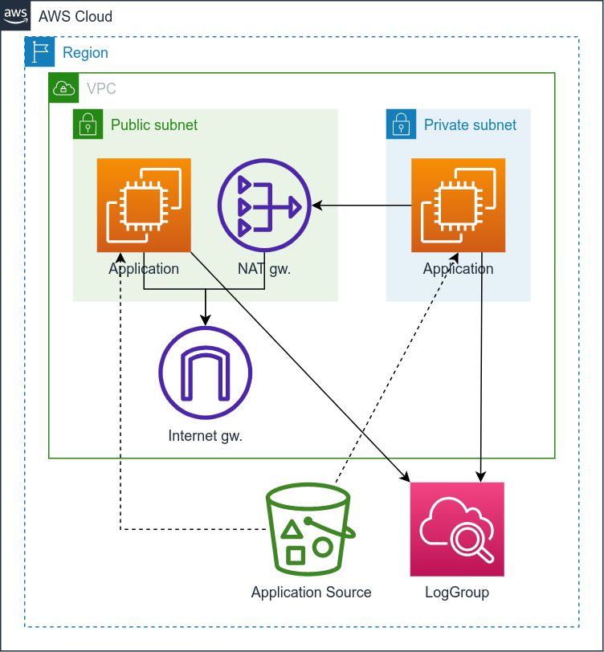

# INFO Stack

The stack contains the **INFO application** deployed to 2 EC2 instaces:

1. A new VPC is deployed with 1 public and 1 private subnet.
2. In each subnet, an EC2 (t2.micro) instance is deployed.
3. On each EC2 instance, a Python Flask application is deployed, which serves information about the instance.
4. The public EC2 instance has CloudWatch integration for both messages and CloudInit logs.

See [README.md](../apps/info/v1/README.md) and [swagger.yml](../apps/info/v1/openapi/swagger.yml) of the application for more information.
The **Swagger UI** application is also available on the `{url}/api/ui` endpoints.

The architecture of the stack: 

## Prerequisites

1. Make sure that the [Initialization](../README.md) is done and **virtual env** is enabled.
   
## Deploying

1. Execute the following command to deploy the `cloudxinfo` stack (in the folder of the main [README](../README.md)):
   ```shell
   invoke deploy.cloudxinfo
   ```
   - To deploy other version of the application, execute the deploy comment with `--version`, e.g.:
     ```shell
     invoke deploy.cloudxinfo --version=2
     ```
2. If the script ask for confirmation to deploy the changes, then input a `y` and ht **Enter**:
   ```
   Do you wish to deploy these changes (y/n)? 
   ```
3. Wait for the process to finish.
4. At the end the command will provide you a number of output data that will be useful for testing:
   - The instance ID, Private IPv4 address, and Private DNS of the Private EC2 instance
   - The instance ID, Private IPv4 address, Private DNS, Public IPv4, and Public DNS of the Public EC2 instance

This command should be used for first and all consequitive deployments/updates.

After a re-deployment, it is suggested to reboot the EC2 instance(s). You can use the `aws ec2 reboot-instances --instance-ids <id>`, where the `<id>` can be found in the output of the deploy script. A reboot might take a couple of minutes.

## Destroying

1. Execute the following command to destroy the alreay deployed `cloudxinfo` stack (in the folder of the main [README](../README.md)):
   ```shell
   invoke destroy.cloudxinfo
   ```
2. If the script ask for confirmation to destroy the stack, then input a `y` and hit **Enter**:
   ```
   Are you sure you want to delete: cloudxinfo (y/n)? 
   ```
3. Wait for the process to finish.